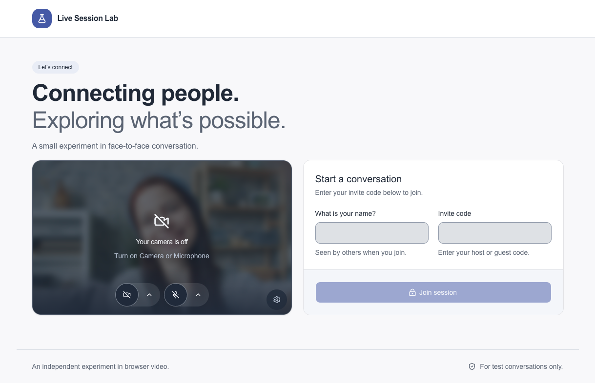

# Live Session Lab

## Connecting people. Exploring what's possible.

A private video call, right in your browser. Live Session Lab brings two people together with an invite code.
Preview your camera, choose your microphone, and join when you are ready. No account or application download is required.

Built as an independent experiment with WebRTC and AI-assisted development.

## A focused call experience

- **Your guest takes the main view.** Your own video stays in a small picture-in-picture overlay.
- **Controls stay with the video.** Turn your camera or microphone on and off, or choose an input from its menu.
- **Use the space you have.** Responsive layouts support smaller screens. Joined calls offer a 16:9 fullscreen view with black margins.
- **Join on your terms.** Use video, audio only, or listen with both inputs off. Confirm before leaving the call.

## Join a conversation

Open the application address shared by the operator. Enter your host or guest invite code and a temporary name.
A private invitation link can fill the code for you. Choose the devices you want to use, then select **Join session**.

Each code holds one place in the room. Reusing a code replaces that code's current connection.
The host and guest have the same call controls. Camera and microphone access requires browser permission.

This is a demo for test conversations. Keep personal or sensitive information out of calls.
The app adds no recording, transcription, or analytics. It uses encrypted transport and makes no end-to-end encryption claim.
See [Privacy and cost](planning-docs/privacy-and-cost.md) for provider processing and operating limits.

## Built in the open

Next.js, React, and TypeScript power the application. shadcn/ui and Tailwind CSS provide the interface.
LiveKit handles signaling and WebRTC media. The application uses no database.

Development follows a public plan with human review at each phase. Automated checks and physical-device reports are recorded separately.
Public deployment is pending. The [validation record](planning-docs/validation.md) lists current results and release checks.

- [Developer guide](docs/developers.md): run locally, configure private calls, and test changes.
- [Development plan](planning-docs/README.md): scope, architecture, and delivery phases.
- [AI development](docs/ai-development.md): Codex workflow, skills, and MCP tools.

Source code is available under the [MIT license](LICENSE). Placeholder photographs have separate [source and license details](docs/image-sources.md).
