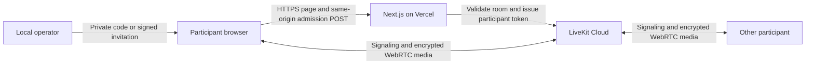

# Architecture

## System boundary

Next.js serves the interface and the token endpoint. LiveKit handles signaling and WebRTC media transport.
The application has no database or user accounts. Each room has two server-generated participant identities.
The public interface is at `/`. The only application API is `POST /api/token`.

## Responsibilities

| Module                                                 | Responsibility                                                                             |
| ------------------------------------------------------ | ------------------------------------------------------------------------------------------ |
| `src/app/page.tsx` and `src/components/page-frame.tsx` | Page composition, introduction, and footer.                                                |
| `src/components/private-call.tsx`                      | Credential lifecycle, join form, input menus, SDK state presentation, and connected media. |
| `src/lib/call-session.ts`                              | Local track ownership, input discovery, joining, cancellation, and cleanup.                |
| `src/lib/call-feedback.ts`                             | Fixed participant-facing status and error messages.                                        |
| `src/components/video-stage.tsx`                       | Main video, local inset, media controls, and popovers.                                     |
| `src/lib/use-video-fullscreen.ts`                      | Native fullscreen, viewport fallback, focus management, and exit cleanup.                  |
| `src/lib/server/admission.ts`                          | Request validation, provider room validation, and restricted token issuance.               |
| `src/lib/server/invite-codes.ts`                       | Server configuration and timing-safe code comparison.                                      |
| `src/lib/server/invitations.mjs`                       | Signed invitation validation and stable participant identities.                            |
| `scripts/operator/invite.mjs`                          | Local generation of optional expiring invitation pairs.                                    |

Configuration and commands belong in the [developer guide](../docs/developers.md). Test outcomes belong in [Validation](validation.md).

## Admission flow

1. The operator privately shares a host code, guest code, or signed invitation link.
2. The browser reads `#invite`, removes the fragment, and retains the credential in memory.
3. A code link fills the masked, read-only code field. A signed invitation hides that field.
4. The participant enters a temporary name, selects media, and requests admission.
5. The browser sends either `{code, displayName}` or `{invitation, displayName}` through same-origin POST.
6. The server validates origin, admission state, content type, input shape, and credential before provider operations.
7. The server validates the room configuration and issues a five-minute, room-scoped LiveKit token.
8. The browser connects to LiveKit and publishes only the selected local media.

The endpoint rejects cross-site requests, extra fields, bodies larger than 4,096 bytes, and client-selected room or identity values.
Names contain 1-40 trimmed characters without control or format characters.
All responses use `Cache-Control: no-store, private`, `Pragma: no-cache`, and `Vary: Origin`.
Errors return fixed categories. Request bodies and credentials must not enter logs.

### Reusable codes

Distinct host and guest codes select places 1 and 2 in one configured `lsl-UUID` room.
Codes use 20-128 ASCII letters, digits, underscores, or hyphens. Placeholder values are rejected.
Use cryptographically random values. Codes are case-sensitive and have no automatic expiry.
They remain valid across server restarts. Rotation blocks future exchanges after the server applies the new configuration.

### Signed invitations

The local operator command signs one invitation for each place. It defaults to one hour of validity.
Supported validity is 1-1,440 minutes. The command can create a random room name or use a supplied room.
Invitations use HS256 with a separate signing secret of at least 32 bytes.
Validation checks the signature, issuer, audience, room, place, timestamps, and maximum lifetime.
The endpoint rechecks expiry after the provider request. Signing an invitation does not create a provider room.

### Two participant places

Identity derives from the validated room and place. Concurrent exchanges cannot allocate a third identity.
Reusing a code or invitation replaces its current connection. The other place remains connected.
Host is a participant label, not an administrative role. Credentials do not establish a person's real identity.

Room creation and token room configuration specify `maxParticipants: 2`, a 300-second empty timeout, and a 20-second departure timeout.
The endpoint refuses a room with an incompatible name or participant limit.
The provider limit is a secondary setting. Two stable identities establish the application's admission boundary.
This is a replacement model, not a strict device reservation system.

Tokens permit room joining, subscription, and camera/microphone publication only.
They disable data publication, participant metadata updates, room administration, room creation, room listing, and recording grants.
Invitation expiry, code rotation, and disabled admission do not terminate existing calls or revoke issued tokens.

## Media ownership and recovery

`CallSession` owns local capture tracks. Preview elements attach and detach those tracks without creating separate capture owners.
On join, selected tracks publish to the SDK room. Leaving, failed joins, cancellation, and disposal stop owned capture.
Late capture results from cancelled operations are stopped when they resolve.

No capture or enumeration starts automatically when the home page opens.
Enabling an input starts preview. Opening or refreshing an input menu can request temporary permission when device labels are unavailable.
Discovery requests only that input type and stops its temporary tracks after enumeration. It does not publish or display them.
An active input is not reacquired for discovery. Passive device-change events do not request permission.

Device selection can occur while an input is off. Media indicators follow actual SDK state.
LiveKit owns reconnection. The application shows connecting, reconnecting, disconnected, and failure states without a separate reconnect loop.
Blocked playback offers an explicit audio action. Audio-only participation and joining with both inputs off are supported.

Confirmed leave clears the credential and name, stops capture, exits fullscreen, and returns to the join form.
Reloading clears in-memory access details. Page exit disposes the session; restored pages reload to avoid stale call state.
A replaced participant loses its connection and releases capture.

## Interface

Tailwind provides responsive layouts and shared theme variables. Repository-owned shadcn/ui components provide accessible controls.
LiveKit components and hooks supply media behavior. System fonts and local placeholder photographs require no external asset requests.

The join form and preview have equal heights in the two-column layout. Preview video covers the available frame.
The connected stage shows the remote participant as the main video and the local participant in a top-right inset.
Camera-off backgrounds differ for pre-join, local, and remote participants.
Media controls overlay the video. Device lists and connection details use popovers.

Fullscreen is available only after joining. Use native element fullscreen when supported, with a viewport fallback when unavailable or rejected.
The fullscreen surface stays 16:9 as the viewport changes. Unused space is black; video uses contain scaling in fullscreen.
Menus and leave confirmation stay inside the fullscreen stage. The fallback restricts outside interaction and supports Escape.
Leaving or unmounting releases fullscreen and restores page interaction. No screen orientation lock is required.

## Decisions

| Decision                                   | Reason and tradeoff                                                                          |
| ------------------------------------------ | -------------------------------------------------------------------------------------------- |
| Next.js with a same-origin token route     | Keeps interface and admission in one deployable application. Media travels through LiveKit.  |
| LiveKit official SDKs                      | Provides signaling, media transport, and reconnection without a custom signaling service.    |
| shadcn/ui with Base UI and Tailwind CSS v4 | Keeps component source and theme control in the repository. Add only required components.    |
| Two reusable codes with stable identities  | Supports persistent access without a database. Code reuse replaces an active connection.     |
| Optional expiring signed invitations       | Supports temporary, room-scoped access without stored invitation records.                    |
| Memory-only credentials                    | Avoids application persistence. Reloading requires entry or a private link again.            |
| Standard encrypted transport               | Supports the demo scope. End-to-end encryption and compliance claims are excluded.           |
| Free hosting plans                         | Accepts quota-related service loss. Account settings require verification before deployment. |

See [Privacy and cost](privacy-and-cost.md) for trust boundaries and shutdown limits.
