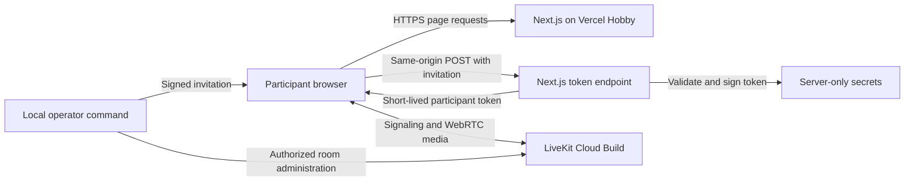

# Architecture

Status: Phase 1 serves the introduction and pre-join shell at `/`, and the room shell at `/room`.
Phase 2 adds the private `/call` route and `POST /api/token`. Capacity acceptance failed.
Synthetic media transport passed; physical-device acceptance remains unverified. See [Validation](validation.md).
The diagram describes the target hosting. The implementation currently runs locally.

## System boundaries

The browser owns preview devices and participant controls. LiveKit handles signaling and media transport.
The Next.js server validates admission and issues participant tokens. Vercel does not relay call media.
The local operator creates invitations and manages active rooms. No database stores invitations or call history.

## Interface structure

Use shadcn/ui for application controls and Tailwind CSS v4 for layout and shared theme variables.
Store component source in the repository. Add only components used by the interface.
Integrate into the existing repository without replacing its scaffolding or package manifest.

Use official LiveKit components and hooks for tracks, playback, and connection state.
Connect custom media controls to SDK actions and observed SDK state. Do not maintain a competing media-state model.
Keep integration in a few understandable browser components and server modules.
Do not create an abstraction for hypothetical replacement video providers.

Configure shadcn/ui and Tailwind during Phase 1 using the official instructions:
[shadcn/ui for Next.js](https://ui.shadcn.com/docs/installation/next) and
[Tailwind CSS for Next.js](https://tailwindcss.com/docs/installation/framework-guides/nextjs).

## Phase 1 implementation

Next.js 16.3.4 uses React 19.3.0 and TypeScript 6.0.3.
Tailwind CSS 4.3.3 defines responsive layouts and semantic theme variables in `src/app/globals.css`.
The official shadcn CLI initialized the Base UI `base-nova` preset in `components.json`.
The repository retains Button, Card, Field, Input, Badge, Alert, NativeSelect, and Empty source.
Label and Separator are dependencies of Field. No custom registry is configured.

`src/components/session-preview.tsx` contains the shared demonstration interface.
Route modules remain small. The display-name field holds input only in the current browser document.
Both routes show disconnected labels. Media controls and admission are disabled.
There are no media SDKs, capture requests, admission endpoints, or provider requests in Phase 1.
The room preview link opens a public layout demonstration. It does not admit a participant to a call.

## Phase 2 interfaces

| Interface                | Input                                                                       | Result                                                  |
| ------------------------ | --------------------------------------------------------------------------- | ------------------------------------------------------- |
| Local invitation command | Room identifier and optional validity duration; server-only signing secret. | Shareable invitation with one-hour default validity.    |
| `POST /api/token`        | Invitation credential and temporary display name.                           | LiveKit server URL and a five-minute participant token. |
| LiveKit room connection  | Issued token and explicit media choices.                                    | SDK connection state and local/remote media.            |

The invitation command intentionally outputs the credential for the operator to share.
Do not copy that output into logs, test artifacts, documentation, or chat.
Use an established cryptographic library for invitation signing and the official server SDK for LiveKit tokens.

The token endpoint validates input, signature, expiry, and request origin before issuing a token.
Use the configured application origin as the expected origin; do not trust an arbitrary request host.
Reject missing or invalid credentials, room substitution, and disabled admission.
Return useful error categories without revealing credential content or internal errors.
Return token responses with `Cache-Control: no-store`. Keep signing and API secrets server-side.

Use the validated invitation to select the room. Generate participant identities on the server.
Grant room join, subscription, and camera/microphone publishing only. Do not grant room administration or data publishing.
Apply the two-participant limit on every room-creation path, including room recreation after all participants leave.
Enforce capacity through LiveKit room configuration, not a browser counter or a read-then-count admission check.
LiveKit exposes the room participant limit through its [RoomService API](https://docs.livekit.io/reference/other/roomservice-api/).

## Phase 2 ownership and admission

`src/lib/server/invitations.mjs` signs and validates room-scoped HS256 invitations with `jose`.
The issuer and audience are specific to this application. Invitations contain an opaque room identifier and an expiry.
The local `scripts/operator/invite.mjs` command defaults to a generated room and one-hour validity.
No operator name or participant name enters the room identifier.

`src/lib/server/admission.ts` validates origin, the admission flag, JSON shape, name length, and invitation claims.
It reads at most 4,096 body bytes and rejects client-provided room or identity fields.
It calls the official `LiveKitAPI` to create or retrieve the validated room with `maxParticipants: 2`.
If the returned room has a different limit, admission fails closed.
Each five-minute token also includes a room configuration with the same limit to protect automatic room recreation.
Existing rooms ignore token configuration. The service response check covers that separate path.
The design depends on LiveKit to arbitrate concurrent joins and reject a third participant.
That dependency failed live validation. Returning `maxParticipants: 2` does not establish enforcement.
Keep admission disabled for external use. A count read before token issuance cannot resolve concurrent admission races.

`src/components/private-call.tsx` reads and removes the URL fragment in its first client effect.
The credential remains in a React ref. It is never written to persistent storage or rendered in the interface.
Only Join posts it to the same-origin endpoint. The issued token is passed directly to `room.connect`.
A reload requires reopening the invitation. Public `/` and `/room` remain disconnected layout previews.

`src/lib/call-session.ts` owns preview tracks created by the official browser SDK.
Explicit button actions start capture. Device enumeration after an action does not request additional permissions.
Join publishes the existing preview tracks to the connected room. It does not acquire replacement tracks.
The SDK owns tracks enabled after joining. Leave disconnects with `stopTracks: true` and stops all retained preview tracks.
A generation counter invalidates late capture and join results after cancellation. Late tracks are stopped immediately.
Unmount and page exit release capture. A restored page from browser history reloads to avoid retaining an inactive session.

`RoomContext`, `useConnectionState`, and `useLocalParticipant` provide observed SDK state to the interface.
`useTracks`, `VideoTrack`, and `RoomAudioRenderer` render participant media. `StartAudio` handles blocked audio playback.
The application does not maintain optimistic mute state or implement its own reconnect loop.
SDK and component logging are silenced. User-facing errors use fixed messages without provider payloads or credentials.

## Participant data flow

1. Read the invitation from the URL fragment and remove it from the visible URL immediately.
2. Hold the invitation in browser memory. Enter a temporary display name and explicitly enable preview devices.
3. On Join, exchange the invitation through the same-origin token endpoint.
4. Join LiveKit with the issued token. Publish only the media the participant enabled.
5. On leave or abandoned preview, disconnect and stop locally owned capture tracks.

Transfer preview ownership carefully during join. Failed joins and component unmounts must not leak tracks or duplicate capture.
Use SDK reconnection behavior. Do not add a competing retry loop.
Rejoin can reuse an unexpired invitation held in memory to request a new token.
A page reload clears this memory; the participant must reopen the original invitation.
Admission expiry limits future admission. It does not end an existing call.

## Decision record

Decisions accepted on 2026-09-10. These are design choices, not test results.

| Decision                                 | Reason and tradeoff                                                                                             |
| ---------------------------------------- | --------------------------------------------------------------------------------------------------------------- |
| Managed LiveKit transport                | Keep effort on the application and media lifecycle. Accept provider dependency and free quotas.                 |
| shadcn/ui and Tailwind v4                | Keep editable components and shared responsive styling. Test accessibility after composition and customization. |
| Private invitations and two participants | Limit public exposure and keep initial validation focused. Visitors need an operator-provided invitation.       |
| Signed invitations without a database    | Avoid persistent participant data and another service. Individual invitation revocation is limited.             |
| Standard encrypted transport             | Keep the first release focused on test conversations. End-to-end media encryption is outside this release.      |
| Vercel Hobby and LiveKit Build           | Target zero service charges. Accept interruption at free limits and recheck terms before deployment.            |

Phase 1 implementation decisions on 2026-09-10:

| Decision | Reason and tradeoff |
| --- | --- |
| Native device selects | Keep the shell simple and usable on mobile. They remain disabled until device integration exists. |
| System fonts | Avoid an external font download during builds or page loads. |
| Public `/room` preview | Allow layout review without credentials. This route currently provides no call access. |
| Separate Playwright versions | Use stable Playwright Test 1.63.0 and the MCP's locked alpha dependency. Resolve each browser installer from its owning package. |
| Semantic theme and focus override | Maintain consistent contrast and visible keyboard focus after component composition. |

See [Privacy and cost](privacy-and-cost.md) for data boundaries and operational limitations.

Phase 2 implementation decisions on 2026-09-10:

| Decision | Reason and tradeoff |
| --- | --- |
| Separate `/call` route | Keep accepted public demonstrations available while private invitations open the functional integration. |
| `jose` 6.2.12 with HS256 | Use an established signing implementation and a server-only secret. Bearer invitations can be shared until expiry. |
| Capacity in room creation and tokens | Request capacity on all creation paths. The provider test failed; this decision needs resolution before external use. |
| Single owner for preview tracks | Publish existing capture on join; stop retained tracks after failure or exit. |
| Disable admission during default browser tests | Make checks independent of local credentials and prevent accidental provider usage. |

SDK versions: `livekit-client` 2.22.3, `@livekit/components-react` 2.9.24, and `livekit-server-sdk` 2.19.0.
Verified APIs through the LiveKit documentation MCP and the installed SDK declarations.
References: [tokens and room configuration](https://docs.livekit.io/frontends/reference/tokens-grants/),
[room management](https://docs.livekit.io/intro/basics/rooms-participants-tracks/rooms/),
[camera and microphone](https://docs.livekit.io/transport/media/publish/), and
[React components](https://docs.livekit.io/reference/components/react/).
