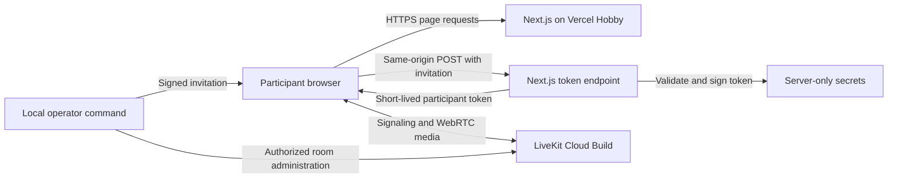

# Architecture

Status: proposed application design. No application endpoints or media integration exist yet.

## System boundaries

The browser owns preview devices and participant controls. LiveKit handles signaling and media transport.
The Next.js server validates admission and issues participant tokens. Vercel does not relay call media.
The local operator creates invitations and manages active rooms. No database stores invitations or call history.

## Interface structure

Use shadcn/ui for application controls and Tailwind CSS v4 for layout and shared theme variables.
Store component source in the repository. Add only components used by the interface.
Integrate into the existing repository without replacing its scaffolding or package manifest.

Use official LiveKit components and hooks for tracks, playback, and connection state.
Connect custom media controls to SDK actions and observed SDK state. Do not maintain a competing media-state model.
Keep integration in a few understandable browser components and server modules.
Do not create an abstraction for hypothetical replacement video providers.

Configure shadcn/ui and Tailwind during Phase 1 using the official instructions:
[shadcn/ui for Next.js](https://ui.shadcn.com/docs/installation/next) and
[Tailwind CSS for Next.js](https://tailwindcss.com/docs/installation/framework-guides/nextjs).

## Planned interfaces

| Interface | Input | Result |
| --- | --- | --- |
| Local invitation command | Room identifier and optional validity duration; server-only signing secret. | Shareable invitation with one-hour default validity. |
| `POST /api/token` | Invitation credential and temporary display name. | LiveKit server URL and a five-minute participant token. |
| LiveKit room connection | Issued token and explicit media choices. | SDK connection state and local/remote media. |

The invitation command intentionally outputs the credential for the operator to share.
Do not copy that output into logs, test artifacts, documentation, or chat.
Use an established cryptographic library for invitation signing and the official server SDK for LiveKit tokens.

The token endpoint validates input, signature, expiry, and request origin before issuing a token.
Use the configured application origin as the expected origin; do not trust an arbitrary request host.
Reject missing or invalid credentials, room substitution, and disabled admission.
Return useful error categories without revealing credential content or internal errors.
Return token responses with `Cache-Control: no-store`. Keep signing and API secrets server-side.

Use the validated invitation to select the room. Generate participant identities on the server.
Grant room join, subscription, and camera/microphone publishing only. Do not grant room administration or data publishing.
Apply the two-participant limit on every room-creation path, including room recreation after all participants leave.
Enforce capacity through LiveKit room configuration, not a browser counter or a read-then-count admission check.
LiveKit exposes the room participant limit through its [RoomService API](https://docs.livekit.io/reference/other/roomservice-api/).

## Participant data flow

1. Read the invitation from the URL fragment and remove it from the visible URL immediately.
2. Hold the invitation in browser memory. Enter a temporary display name and explicitly enable preview devices.
3. On Join, exchange the invitation through the same-origin token endpoint.
4. Join LiveKit with the issued token. Publish only the media the participant enabled.
5. On leave or abandoned preview, disconnect and stop locally owned capture tracks.

Transfer preview ownership carefully during join. Failed joins and component unmounts must not leak tracks or duplicate capture.
Use SDK reconnection behavior. Do not add a competing retry loop.
Rejoin can reuse an unexpired invitation held in memory to request a new token.
A page reload clears this memory; the participant must reopen the original invitation.
Admission expiry limits future admission. It does not end an existing call.

## Decision record

Decisions accepted on 2026-09-10. These are design choices, not test results.

| Decision | Reason and tradeoff |
| --- | --- |
| Managed LiveKit transport | Keep effort on the application and media lifecycle. Accept provider dependency and free quotas. |
| shadcn/ui and Tailwind v4 | Keep editable components and shared responsive styling. Test accessibility after composition and customization. |
| Private invitations and two participants | Limit public exposure and keep initial validation focused. Visitors need an operator-provided invitation. |
| Signed invitations without a database | Avoid persistent participant data and another service. Individual invitation revocation is limited. |
| Standard encrypted transport | Keep the first release focused on test conversations. End-to-end media encryption is outside this release. |
| Vercel Hobby and LiveKit Build | Target zero service charges. Accept interruption at free limits and recheck terms before deployment. |

See [Privacy and cost](privacy-and-cost.md) for data boundaries and operational limitations.
